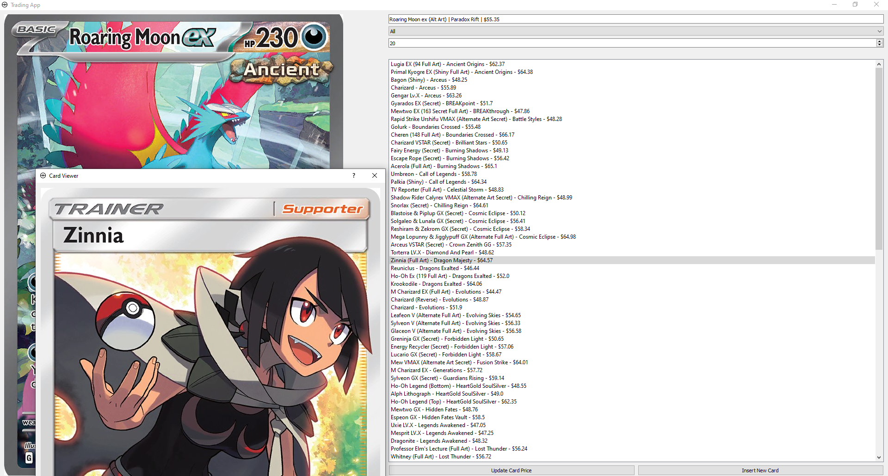

<!-- Trading App - Pokémon Card Value Checker -->

# Trading App - Pokémon Card Value Checker

This app is designed to help you determine the trade value of your Pokémon cards. Prices will be updated every two weeks.
Follow these simple steps:

## How to Use the App
1. Download and extract the [App](https://drive.google.com/file/d/1R6AVEEgVyCDInMn9bTUfjgEDjZKK0Y6h/view?usp=sharing)
2. Run pip install -r requirements.txt or install PyQt5 in directory
3. Enter the name of your Pokémon card in the search bar.
4. Hit Enter or select from the suggested cards.
5. You will receive a list of Pokémon cards whose values are within a range of 10% above or below your card's estimated value.
6. Click on a card's name to view a photo of the card.

## About the App

This app helps you make informed decisions about the value of your Pokémon cards when trading. It's a handy tool for collectors and traders alike. 

At the moment the card database contains cards from D/P-S/V (Excluding Promos), older cards will be added in the future!

Prices updated as of 3/19/25

Happy trading!

